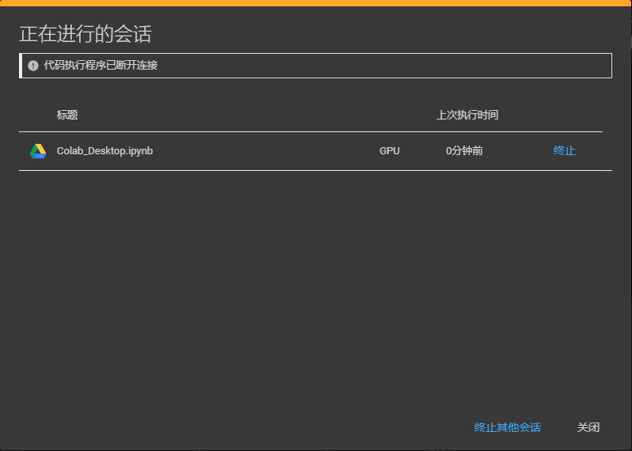
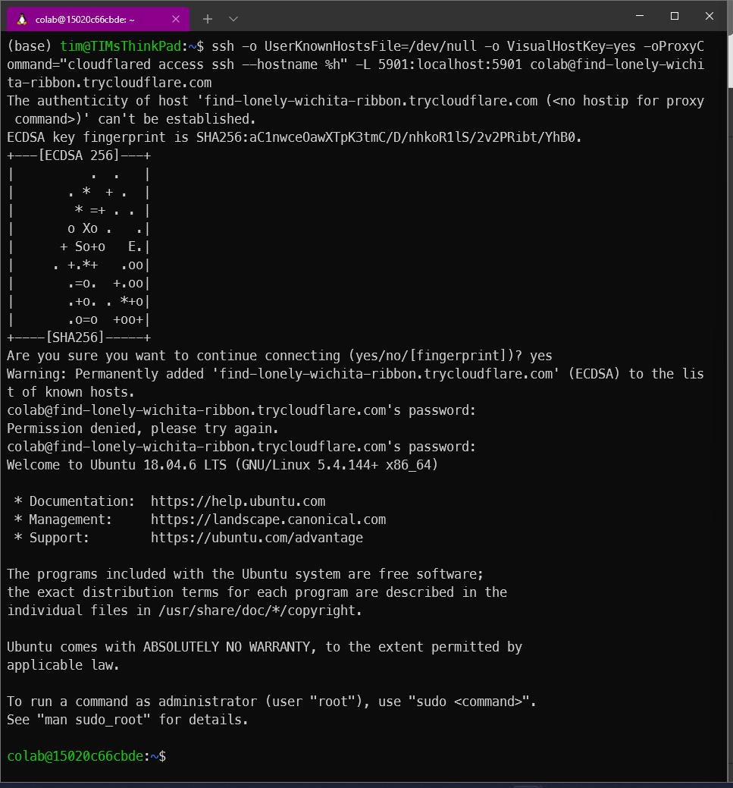
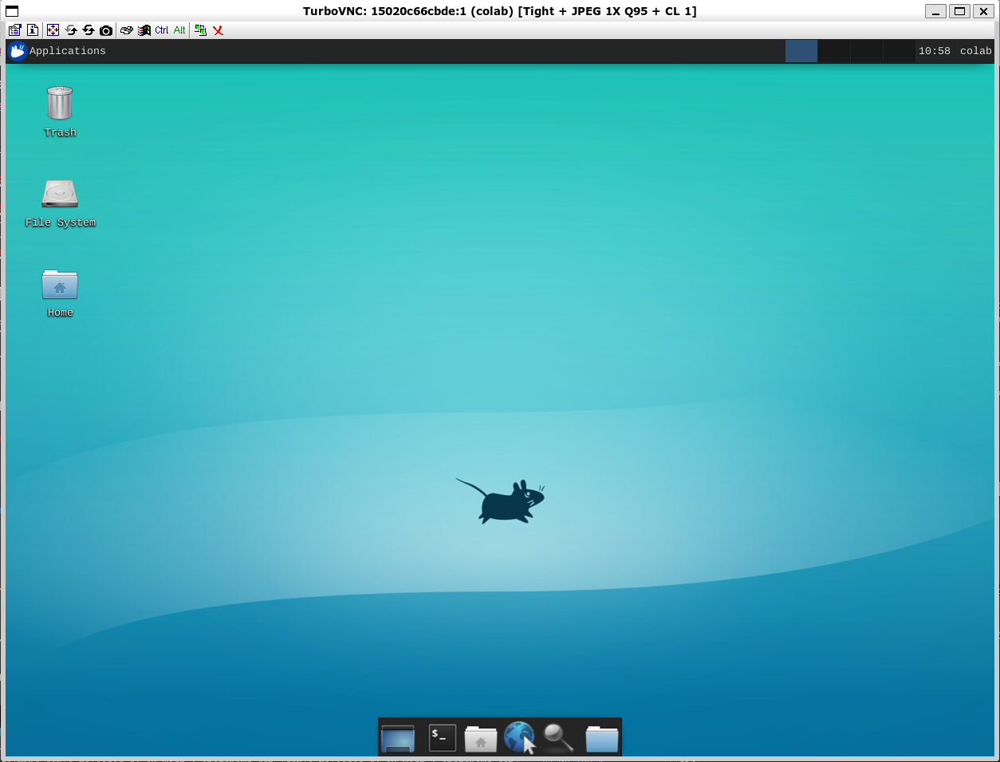

#! https://zhuanlan.zhihu.com/p/494051978
# Colab 远程桌面

> - 感谢 Tomohiro 大佬的代码，使得远程获取 Colab 桌面变成可能。大佬的 [主页](https://internet-of-tomohiro.netlify.app/google_colab/vnc.en.html) 以及大佬的 [Github](https://github.com/demotomohiro/remocolab)
> - 本文的 [Github](https://github.com/Alexbeast-CN/Colab_Desktop) 以及 [Colab](https://colab.research.google.com/drive/1-5IZlnvTXyyJKJtx3OhoNX3zthoyQvTl?usp=sharing)

## 0. 前言

使用前的一些说明，原理上来说，应该是所有系统都可以使用这个方法来获取到  Colab 的远程桌面的，但是目前我尝试了我只在 Linux 系统上成功连接了远程桌面，由于我没有 Mac 所以无法尝试。而 Windows 失败的点，我将会在后面说到。

## 1. 准备软件

1. 安装 [Cloudflare](https://developers.cloudflare.com/cloudflare-one/connections/connect-apps/install-and-setup/installation)。假如是 Linux 系统选择
2. 安装 [TurboVNC](https://sourceforge.net/projects/turbovnc/)。往下翻可以找到适用于不同系统的安装包。如果是 Linux 版本，下载完 .deb 文件后，请在文件目录下使用 `sudo apt-get install -f` 来安装该文件。
3. 安装 SSH Client，这个一般来说系统自带的都有，如果 windows 用户不确定自己有没有这个软件，可以在开始菜单里搜索 `添加可以选功能` -> `OpenSSH Client`

## 2. 修改运行时

在 Colab 笔记本上面的菜单栏里点击 `修改` -> `笔记本设置` -> `硬件加速` -> `GPU`

## 3. 创建远程连接

完成上诉任务后在 Colab 里运行下面的代码：

- 该段代码会设置好服务器端的 OpenSSH, VirtualGL 以及 TurboVNC。
- 运行完成后连接方式以及密码会在下方显示。

> 注意当成功运行完一次下面的代码后，再次运行可能会报错。原因是一台服务器在运行时只能设置一次，如果本地电脑提示连接失败，要想再次连接则需要将服务器端先关闭后再连接。
>
> 具体方法是先将点击右上角 RAM，磁盘 右边向下的三角 -> 管理会话 -> 终止当前的会话。




```python
!pip install git+https://github.com/demotomohiro/remocolab.git
import remocolab
remocolab.setupVNC()
```

    Collecting git+https://github.com/demotomohiro/remocolab.git
      Cloning https://github.com/demotomohiro/remocolab.git to /tmp/pip-req-build-vzejlrco
      Running command git clone -q https://github.com/demotomohiro/remocolab.git /tmp/pip-req-build-vzejlrco
    Collecting pyngrok
      Downloading pyngrok-5.1.0.tar.gz (745 kB)
         |████████████████████████████████| 745 kB 27.5 MB/s 
    [?25hRequirement already satisfied: PyYAML in /usr/local/lib/python3.7/dist-packages (from pyngrok->remocolab.py==0.1) (3.13)
    Building wheels for collected packages: remocolab.py, pyngrok
      Building wheel for remocolab.py (setup.py) ... [?25l[?25hdone
      Created wheel for remocolab.py: filename=remocolab.py-0.1-py3-none-any.whl size=7553 sha256=fbceba35daeb1cc70c6c2065eedaafb57e796e18014faa010aa6fefb258f5777
      Stored in directory: /tmp/pip-ephem-wheel-cache-rylqg9c3/wheels/80/37/44/386e71ab0cd5aef5cefdb1926b710a42fdb4fe2d07c3b1b08f
      Building wheel for pyngrok (setup.py) ... [?25l[?25hdone
      Created wheel for pyngrok: filename=pyngrok-5.1.0-py3-none-any.whl size=19007 sha256=68752057affa9259e931daf5deb61483d2700ff0ae66ff0e162fa3ae1f95a02f
      Stored in directory: /root/.cache/pip/wheels/bf/e6/af/ccf6598ecefecd44104069371795cb9b3afbcd16987f6ccfb3
    Successfully built remocolab.py pyngrok
    Installing collected packages: pyngrok, remocolab.py
    Successfully installed pyngrok-5.1.0 remocolab.py-0.1
    ---
    As ngrok doesn't work on colab for long time, default tunnel method has been changed to Argo tunnel.
    Please read this for more details:
    https://github.com/demotomohiro/remocolab/blob/master/README.md
    


    Label(value='')


    FloatProgress(value=0.0, layout=Layout(border='1px solid #118800'), max=1.0)


    Install openssh-server
    


    Label(value='')


    FloatProgress(value=0.0, layout=Layout(border='1px solid #118800'), max=1.0)


    Install xfce4
    Install xfce4-terminal
    ED25519 key fingerprint of host:
    256 SHA256:q1rf7t8/afFr4VX7XJavqAeuN/9U2665sraaUGxlOJE root@15020c66cbde (ED25519)
    +--[ED25519 256]--+
    |          ..     |
    |          Eo     |
    |          o o    |
    |         . +    .|
    |        S +     =|
    |         +.    **|
    |      . o. .  o+@|
    |     . o o+.++ O=|
    |    ... o=BO*=X*=|
    +----[SHA256]-----+
    
    ✂️✂️✂️✂️✂️✂️✂️✂️✂️✂️✂️✂️✂️✂️✂️✂️✂️✂️✂️✂️✂️✂️✂️✂️
    root password: mH6p2il8wSS27Vh74gk8qNLbHScZgo3qVKk2jnT-CkE
    colab password: meL5OPTHwoG3YzHIeVZgZ6Oa20iuMMl2gLT_6i3_lE4
    ✂️✂️✂️✂️✂️✂️✂️✂️✂️✂️✂️✂️✂️✂️✂️✂️✂️✂️✂️✂️✂️✂️✂️✂️
    ---
    Execute following command on your local machine and login before running TurboVNC viewer:
    ✂️✂️✂️✂️✂️✂️✂️✂️✂️✂️✂️✂️✂️✂️✂️✂️✂️✂️✂️✂️✂️✂️✂️✂️
    ssh -o UserKnownHostsFile=/dev/null -o VisualHostKey=yes -oProxyCommand="cloudflared access ssh --hostname %h" -L 5901:localhost:5901 colab@find-lonely-wichita-ribbon.trycloudflare.com
    ✂️✂️✂️✂️✂️✂️✂️✂️✂️✂️✂️✂️✂️✂️✂️✂️✂️✂️✂️✂️✂️✂️✂️✂️
    VNC password: cl_C3l4e
    VNC view only password: rsTIKXNR
    ✂️✂️✂️✂️✂️✂️✂️✂️✂️✂️✂️✂️✂️✂️✂️✂️✂️✂️✂️✂️✂️✂️✂️✂️
    
    

## 4. 连接 TurboVNC

1. 使用 SSH 连接到 Colab
  - 在命令行执行上方的 ssh 命令： `ssh -o UserKnownHostsFile...` 开头的那个命令。但不知道为什么这个命令在我的 Windows 电脑上无法成功运行。
  - 使用上面显示的 `colab password: `。



在完成这部操作后，我们的命令行就会变成 Colab 服务器的命令行。

2. 运行 TurboVNC Viewer，如果你使用 Windows 就直接双节 TurboVNC Viewer 的图标，如果你使用的 Linux，则输入 ` /opt/TurboVNC/bin/vncviewer` 来打开。
  - 连接到地址 `localhost:1`
  - 使用上面显示的 `VNC password`


在完成这步后就可以获取到服务器桌面了。



但 Colab 本身是一个临时的 VM，运行时产生的文件在关闭后都会消失。为了解决这个文件，我们可以将 Google Drive 安装到当前的 VM 上：


```python
from google.colab import drive
drive.mount('/content/drive')
```

    Mounted at /content/drive
    

## 5. 小技巧

为了获取更长的 Colab 使用时间，可以添加下面的Chrome 插件：

[Colab alive](https://chrome.google.com/webstore/detail/colab-alive/eookkckfbbgnhdgcbfbicoahejkdoele/related)
